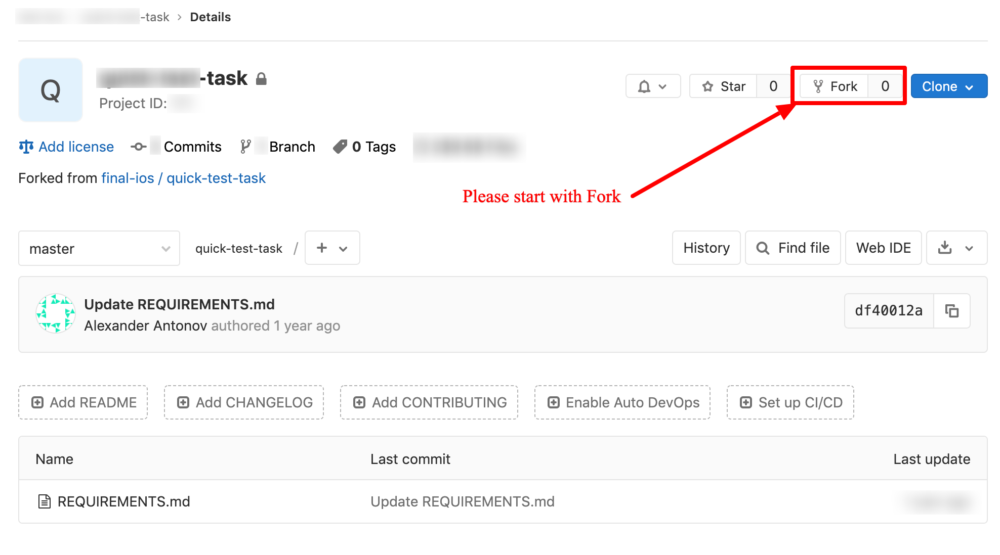

# Тестовое задание

- написать приложение “Морской мир” согласно [спецификации](REQUIREMENTS.md).

## Подсказки

- Первым шагом необходимо сделать `fork` проекта

- После того, как вы закончили работу над проектом нужно сделать `push` с вашей локальной машины

